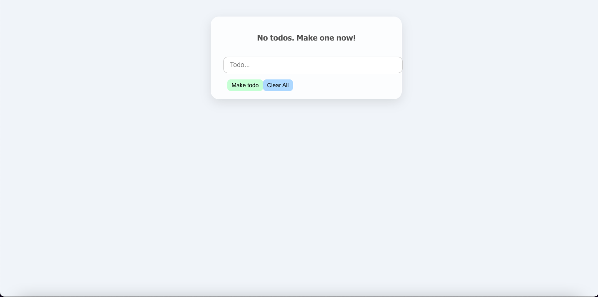
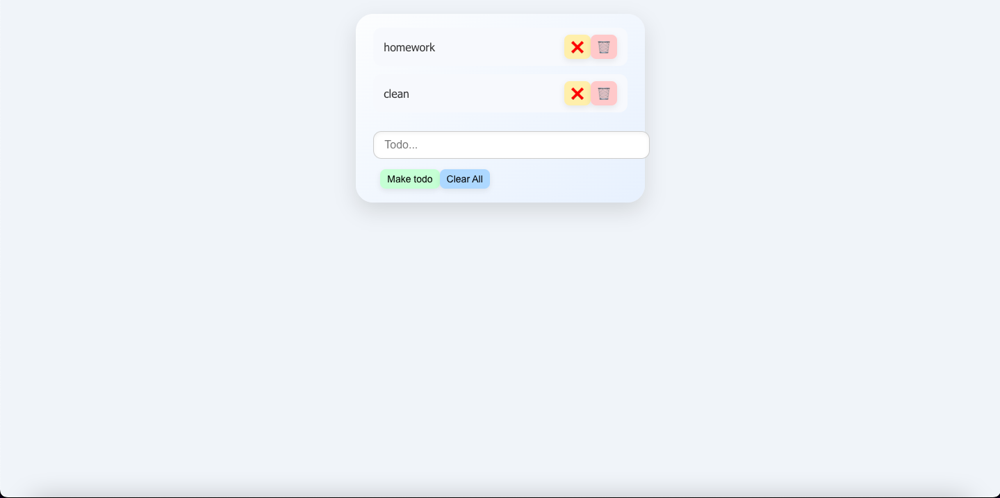

### MERN TODO APP

A simple MERN (MongoDB, Express, React, Node.js) Todo app.

Features: Add todos, delete todos, and mark todos as completed.

Tech Stack: Frontend: React, Backend: Node.js + Express, Database: MongoDB, Styling: CSS

